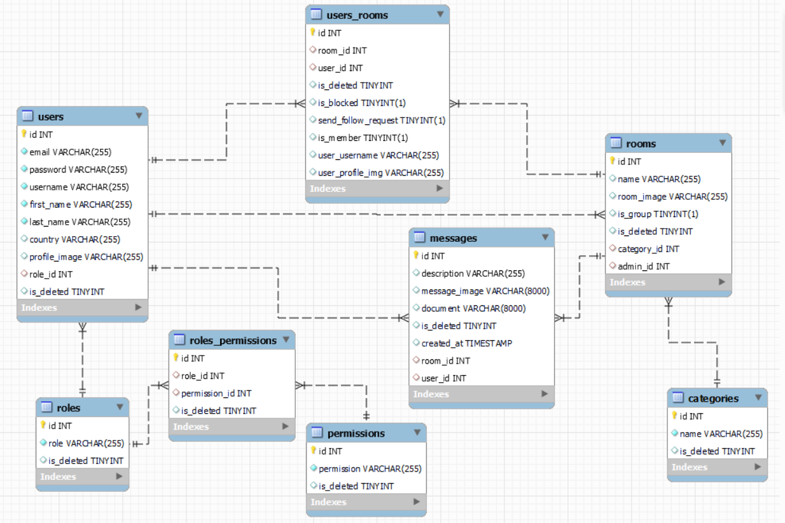

<p align="center">
  <a href="" rel="noopener">
 </a>
</p>

<h3 align="center" style ={{color :rgb(88,101,242) }}>Discord</h3>

---

<p align="center"> An awesome Project to descripe README 
    <br> 
<a href=''>Demo</a>
    <br> 
</p>

## 📝 Table of Contents

- [About](#about)
- [Getting Started](#getting_started)
- [Usage](#usage)
- [Built Using](#built_using)
- [User Story](#user_story)
- [Data Flow](#data_flow)
- [Guided By](#guided_by)

## 🧐 About <a name = "about"></a>

Write about 1-2 paragraphs describing the purpose of your project.

Ex. Are you looking for a quick and easy way to action, action, and action? The **(name of application)** is the greatest and most accurate application to do this for you. It helps you to **(list of activities)**. The **(name of application)** provides a simple design to ensure having the best user experience.

## 🏁 Getting Started <a name = "getting_started"></a>

These instructions will get you a copy of the project up and running on your local machine for development and testing purposes.

### Prerequisites

- Visual Studio Code follow this <a href='https://code.visualstudio.com/download'>link</a> to install.
- Git Bash follow this <a href='https://git-scm.com/downloads
'>link</a> to install.
- MySQL follow this <a href='https://dev.mysql.com/downloads/workbench/'>link</a> to install.
- Node.js follow this <a href='https://nodejs.org/en/download/'>link</a> to install.

### Installing:

1. Clone the repo to your local machine using git bash.

```
git clone [https://github.com/your_username_/Project-Name.git](https://github.com/PiratesC5/Project-5)
```

2. Install packeges repeat this step in backend and frontend folder

```
npm i
```

3. Run server using git bash inside backend folder

```
npm run dev
```

4. Run application using git bash inside frontend folder

```
npm run start
```

Now app ready to use

## 🎈 Usage <a name="usage"></a>

Use this space to show useful examples of how a project can be used. Additional screenshots, code examples and demos work well in this space. You may also link to more resources.

Ex.
- You don't have to register to navigate our web app
- You can click on the **Home** tab provided in the navigation bar to view the home section
- You can click on the **Add to cart** button to add this product to your cart but you have to be one of our users, so you should create an account 

## ⛏️ Built Using <a name = "built_using"></a>

- [MySQL](https://www.mysql.com/) - Database
- [Express JS](https://expressjs.com/) - Server Framework
- [React JS](https://https://reactjs.org/) - Web Framework
- [Node JS](https://nodejs.org/en/) - Server Environment
- [Sokit io](https://socket.io/) - JavaScript library for real-time web applications.
- [Redux](https://redux.js.org/) - JavaScript library for maneging the states in our application.

## User Story <a name = "#user_story"></a>

Your trello board link
<a href='https://trello.com/b/zU6SKUCN/project-5-the-pirates'>Trello</a>

## Data Flow <a name = "#data_flow"></a>

</a>

## ⚠️ Guided By <a name = "guided_by"></a>

This project is guided by ©️ **[MERAKI Academy](https://www.meraki-academy.org)**
